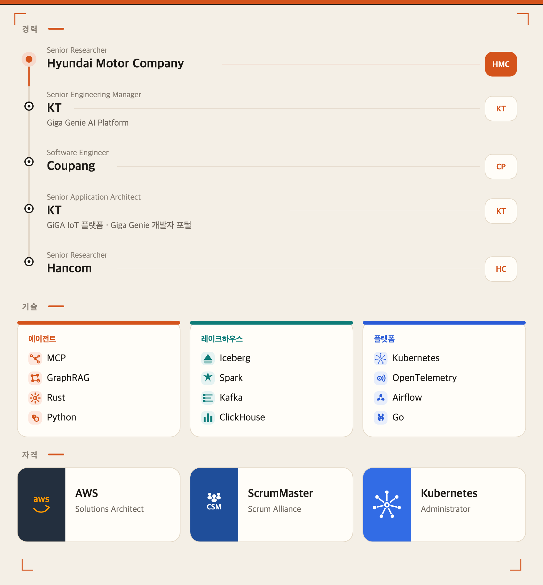

<h1 align="center">SangSun Park</h1>

<p align="center"><b>spark</b></p>

<p align="center">
  Cloud Native DevOps Engineer
  <br>
  데이터 플랫폼 · 에이전트 도구
  <br>
  Hyundai Motor Company 책임연구원 · 서울
</p>

<p align="center">
  <a href="https://sparktype.dev">sparktype.dev</a>
  &nbsp;·&nbsp;
  <a href="https://www.linkedin.com/in/sangsun-park-79b3081a/">LinkedIn</a>
  &nbsp;·&nbsp;
  <a href="https://www.facebook.com/sparkman76">Facebook</a>
</p>

<p align="center">
  
</p>

## 작업

| | |
| --- | --- |
| [**sparktype.dev**](https://sparktype.dev) | 이 저장소에서 배포하는 블로그 |
| [**sagebox**](https://github.com/sparktype/sagebox) | AI 에이전트용 비밀 금고. 값은 암호화된 금고에만 있고, 프로그램에는 환경 변수로만 넘긴다 |
| [**decide**](https://github.com/sparktype/decide) | 문장을 만들지 않고 선택, 점수, 확률을 돌려주는 판단 도구 |

`sagebox`와 `decide`는 [sparktype/tap](https://github.com/sparktype/homebrew-tap)으로 설치할 수 있다.

```sh
brew install sparktype/tap/sagebox
brew install sparktype/tap/decide
```

## 이 저장소

`sparktype/sparktype`은 GitHub 프로필이자 블로그 소스다. 글을 추가하고 배포하는 방법은 [BLOG.md](./BLOG.md)에 있다.
