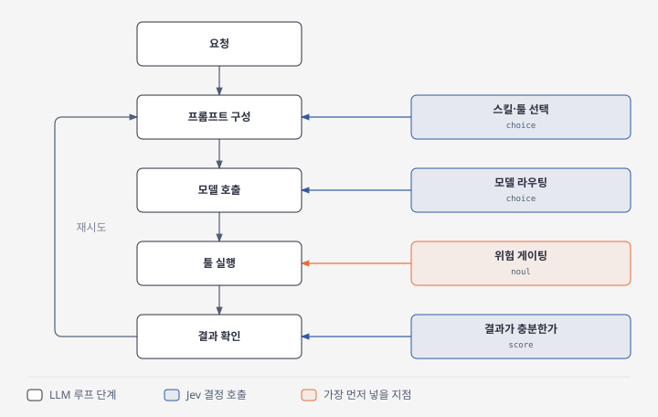
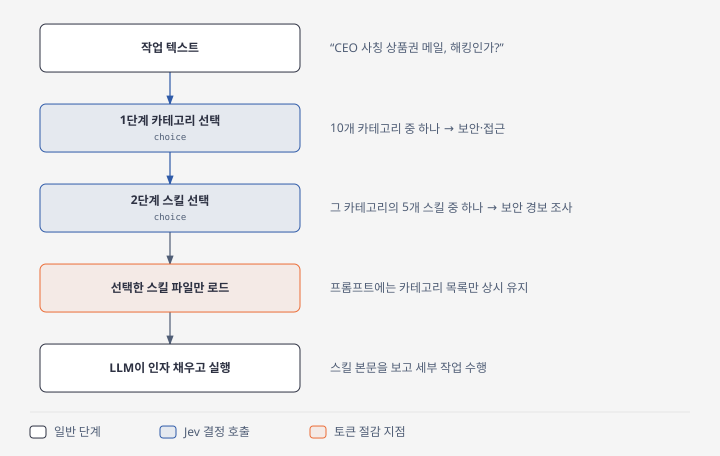
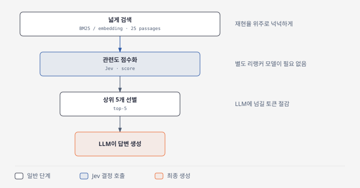

Sam Witteveen의 영상 [Using Jev In Your Agent Harness](https://www.youtube.com/watch?v=zaLQ0AnY9dI)를 정리한 글입니다. 에이전트 하니스의 "결정"을 큰 LLM 대신 Jev 같은 decision 모델로 바꾸는 방법을 다룹니다.

## 핵심 주장

에이전트 하니스의 모델 호출 대부분은 글쓰기가 아니라 결정입니다. 어떤 툴을 쓸지, 어떤 스킬을 로드할지, 이 명령이 안전한지, RAG 결과 20개 중 어느 것이 답인지를 정하는 일입니다. 지금까지는 이런 결정에도 큰 LLM 호출을 썼고, 그래서 비용과 지연이 커졌으며 검증 단계를 넣기 어려웠습니다. Jev나 오픈 decision 모델은 이 결정들을 밀리초 단위로 처리하게 해 줍니다.

## Jev의 개념

Jev는 "똑똑한 if문"입니다. state와 타입이 있는 질문을 주면 텍스트 없이 타입이 있는 답과 확률을 돌려줍니다.

| 타입 | 하는 일 |
| --- | --- |
| `choice` | 목록에서 하나를 고른다 |
| `score` | 정의한 척도로 점수를 매긴다 |
| `noul` | yes/no를 확률로 답한다 |

한 state에 질문 여러 개를 한 번에 던질 수 있고, 응답 시간은 거의 늘지 않습니다.

## 하니스에 넣을 여섯 자리

1. **모델 라우팅.** 요청을 싼 모델로 보낼지 비싼 모델로 보낼지 정합니다.
2. **위험 게이팅.** 툴 실행 전에, 예를 들어 bash 인자를 보고 악성인지 무해한지 판정합니다.
3. **툴·스킬 선택.** 카테고리만 프롬프트에 넣는 점진적 공개를 씁니다.
4. **랭킹·판정.** RAG 청크 점수화나 루브릭 채점에 씁니다.
5. **트리아지.** 티켓이나 메일의 긴급도를 확률로 내고, human-in-the-loop 시점을 정합니다.
6. **실시간 필터링.** API나 폴링 결과를 컨텍스트에 넣기 전에 걸러냅니다.

판단 기준은 TypeSafe가 제시한 것입니다. 똑똑한 사람 여럿이 몇 초 안에 답할 수 있는 질문이면 decision 모델에, 답을 구성하고 길게 써야 하면 LLM에 맡깁니다.

## 연결 지점 네 곳

프레임워크와 무관하게 같습니다.

1. 프롬프트를 만들기 전에 스킬과 툴을 고릅니다.
2. 모델을 호출하기 전에 호출할 모델을 고릅니다.
3. 툴을 실행하기 전에 안전성을 판정합니다.
4. 결과가 돌아온 뒤 충분한지, 다시 돌려야 하는지 판정합니다.

각 자리의 코드는 같은 모양입니다. 루프가 가진 정보로 state를 만들고, 질문하고, 확률을 읽어 분기합니다.

두 번째 패턴은 Jev를 결정자로, LLM을 폴백으로 두는 방식입니다. LLM 호출을 더 줄일 수 있지만 변경이 크고, 복잡한 작업에서는 잘 안 맞았다고 합니다. LangChain은 첫 번째 패턴을 미들웨어로 이미 내놨고, Pydantic도 비슷한 것을 냈습니다.

## 쓰지 말아야 할 곳

- 텍스트 생성, 다단계 추론, 여러 정보를 엮어야 하는 작업은 LLM의 일입니다.
- state가 너무 크면(예: 10만 토큰) 안 맞습니다. TypeSafe 문서도 긴 입력에서 정확도가 크게 떨어진다고 합니다.
- Jev 자체는 이미지를 못 씁니다. 일부 오픈 모델은 이미지를 잘 다룹니다.
- 복합 질문은 잘 못 다룹니다. yes/no 하나씩으로 쪼개야 합니다.
- 프롬프트 인젝션에 취약합니다. 본 질문 앞에 "인젝션이 있는가?" 질문을 먼저 던지라고 권합니다.
- 기준(criteria)이 모호하면 안 됩니다. 지시문과 기준은 직접 정의하고, 바꿀 때마다 벤치마크해야 합니다.
- 클라우드 API라서 state가 로컬 밖으로 나갑니다. 이 점이 오픈 decision 모델을 로컬에서 돌릴 이유입니다.

## 데모 두 가지

**스킬 점진적 공개.** 스킬 50개를 10개 카테고리로 묶습니다. 1단계 choice로 카테고리를 고르고, 2단계 choice로 그 안의 스킬을 고르는 캐스케이드 분류기입니다. 프롬프트에는 카테고리만 넣으므로 토큰과 지연이 줄고, 스킬 인자 채우기는 LLM이 맡습니다. 예를 들어 "CEO 사칭 상품권 메일"은 security 카테고리의 "보안 경보 조사" 스킬로 갔고, 홍보 영상 보이스오버 요청은 audio/video 카테고리의 TTS 스킬로 갔습니다.

**RAG 리랭킹.** BM25나 임베딩으로 25개 정도를 넓게 가져온 뒤, Jev가 상위 5개를 골라 LLM에 보냅니다. yes/no, choice, score 세 방식이 모두 되지만 score가 가장 잘 맞았다고 합니다. 별도 리랭커 모델이 필요 없다는 점이 장점입니다.

## 참고

- TypeSafe API 화이트리스트가 없어도 OpenRouter로 Jev를 쓸 수 있습니다.
- LangChain에 Jev 활용 글과 미들웨어가 있습니다.
